# 1. Table of Contents: <!-- omit in toc -->

<!-- generate at the end, use markdown all in one vscode extension to generate -->

# 2. Project Overview:

This section outlines the real-world problem our system addresses, the intended users who benefit from it, and a brief summary of how the robot functions.

## 2.1 Problem Description and Intended Users

Many chess players today train almost entirely online, but it lacks the physical experience of handling real pieces and maintaining spatial awareness on an actual board. This creates a gap for serious competitors who practice in a digital environment but ultimately compete using physical boards, where skills such as tactile precision, board vision, and real-world timing all matter. Casual players who want to enjoy solo chess on a real board face a similar limitation: without a human opponent, the experience is incomplete.

Our system addresses this gap by providing a physical chess-playing robot that can interact with a real board, respond to human moves, and play full games using an onboard engine. The intended users include competitive players wanting realistic over-the-board training, hobbyists who enjoy playing physical chess whenever they want without needing an opponent, and anyone interested in blending robotics with traditional board-game interaction.

## 2.2 Robot Functionality Summary

ChessBot combines a UR5e robotic arm, a custom gripper, and a computer-vision pipeline to enable a fully physical chess game against an AI opponent. A camera mounted above the board continuously monitors the playing surface, allowing the system to detect piece positions, identify when the human player has moved, and extract the corresponding chess move in real time. This move is passed to the onboard chess engine, which updates the game state and computes the robot’s response. The arm controller then plans and executes a pick-and-place motion to carry out the engine’s move on the physical board using the gripper.

This robot design addresses our customer needs, providing a tactile experience of over-the-board chess while delivering the challenge and adaptability of a computer opponent.

## 2.3 Video Demonstration
[Video Demo](https://drive.google.com/file/d/1yLkw7y4LNCeMz_NkLVMP5ToxRHmnHbvh/view?usp=sharing)

---

# 3. System Architecture:

This section outlines the architecture of our system. It also includes behaviour tree, a description for each node in the system and explanations on custom message type interfaces.

## 3.1 Architecture Diagrams
- Diagram of active nodes (Generated using rqt_graph)
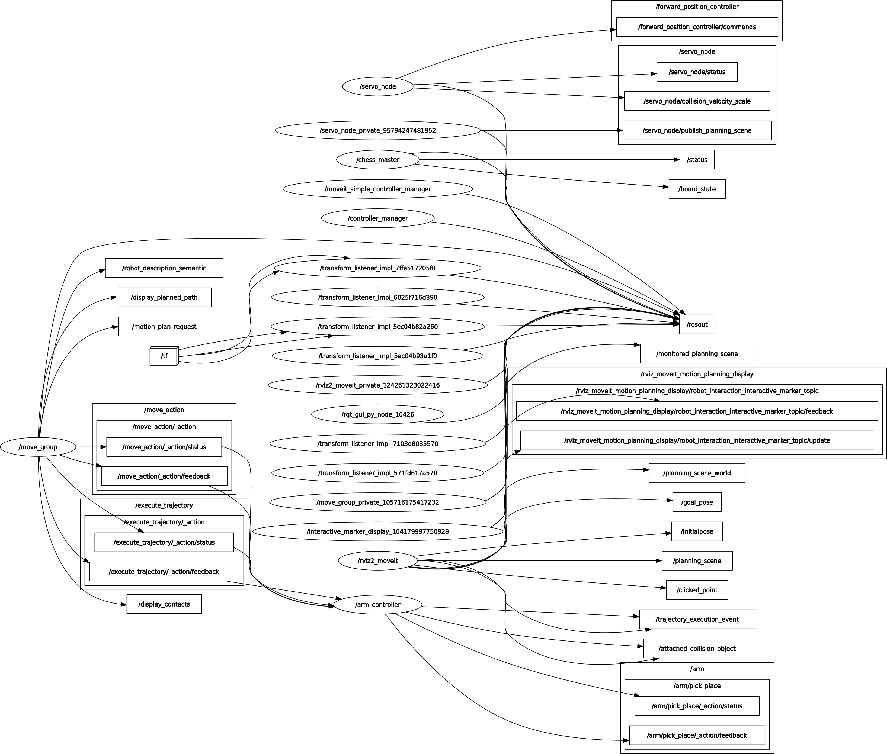
- A package-level architecture diagram showing node interactions and topics
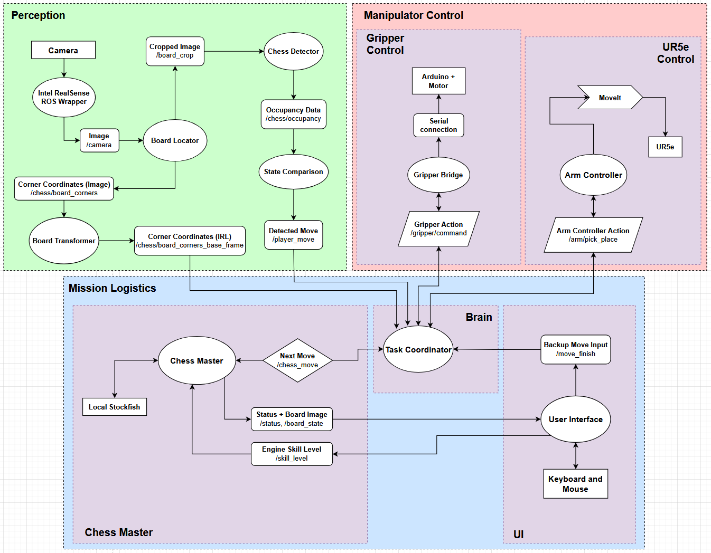

## 3.1.5 Transformation Tree

- Transformation tree diagram (Generated using tf view_frames)
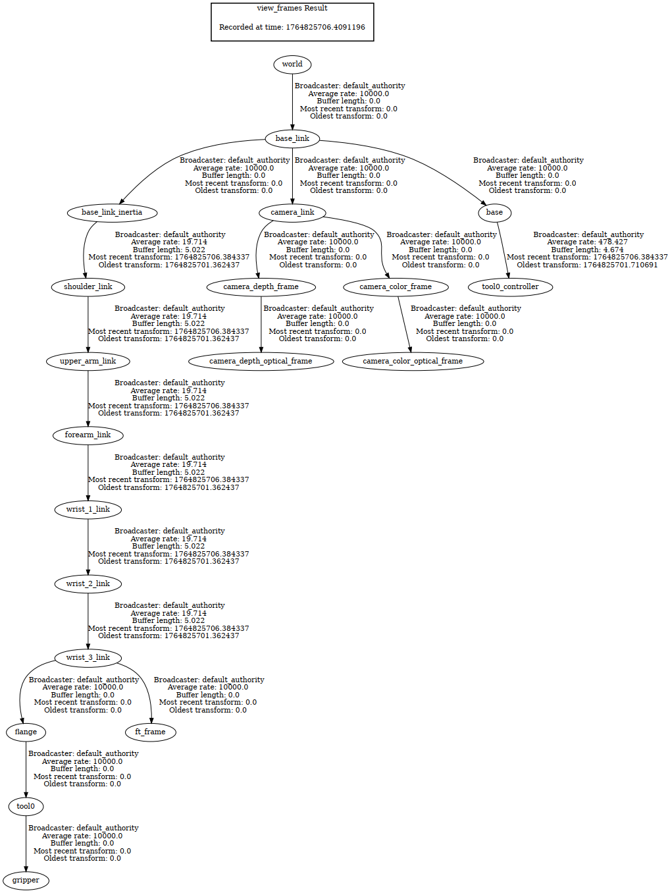

## 3.2 State Diagram

- State diagram of closed-loop system behaviour
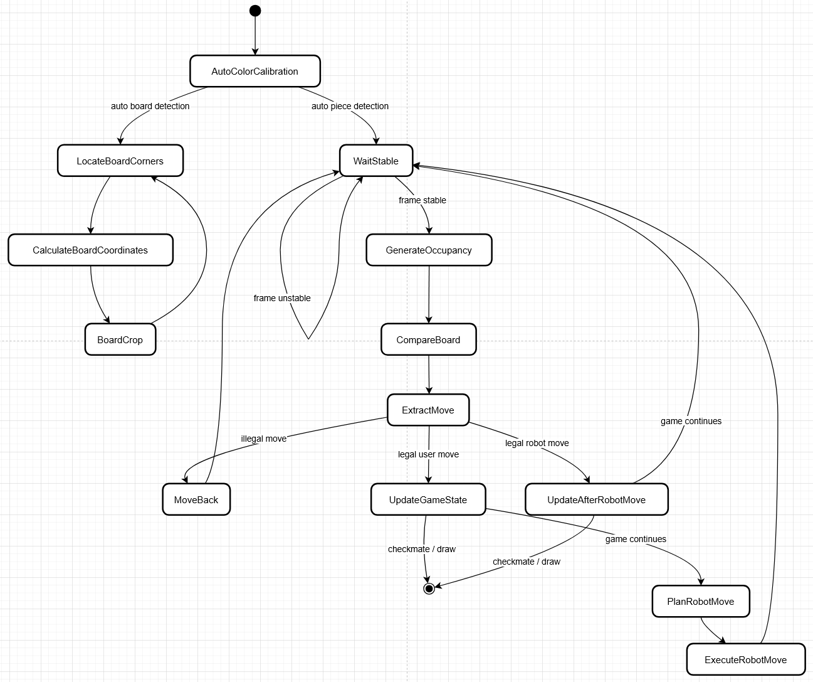

## 3.3 Description of each node

The following section provides a brief description of the function of each active node when running the chess bot.

### Task Coordinator

The Task Coordinator is the central decision-making node that orchestrates the entire chess-playing pipeline. It receives detected moves from perception and validated moves from the chess master. Based on the current game phase, it determines whether the user or robot is acting next. During the robot’s turn, it sequences all actions required to execute a move—issuing pick-and-place goals to the arm controller, triggering the gripper controller, and monitoring perception feedback to verify successful execution. The task coordinator ensures smooth progression of the game by synchronizing perception, planning, manipulation, and UI interaction into one coherent control loop.

### User Interface

The User Interface node provides a manual interaction point for operators. It displays the current game state using SVG, shows status/debug messages from chess master, and allows users to input backup moves when perception fails. It publishes user-confirmed moves and robot-move acknowledgements, ensuring the system can continue operating even under uncertain perception conditions.

### Chess Master

The Chess Master node maintains the internal chess engine and game state. It validates detected moves using Python-Chess, queries Stockfish for the robot’s next move, and publishes legal move decisions to the task coordinator. It also returns game status information (e.g., check, checkmate, illegal move) for display in the UI and for overall mission logic.

### Board Locator

The Board Locator node identifies the chessboard’s four corner coordinates in the camera image. It receives raw RealSense frames, detects the board region, and outputs both the cropped board image and the corner coordinates in image space. These coordinates are critical for generating accurate occupancy grids and mapping camera data to physical board geometry.

### Board Transformer

The Board Transformer converts chessboard corner coordinates from image space into real-world coordinates expressed in the robot’s base frame. Using known camera intrinsics, depth information, and TF transforms, it produces precise board geometry for downstream nodes such as the state comparison and arm controller.

### State Detector

The State Detector node analyzes the cropped chessboard image and generates an 8×8 occupancy grid describing which squares contain pieces. It performs color segmentation, square analysis, and piece presence detection, publishing the resulting board occupancy for comparison against previous game states.

### State Comparison

The State Comparison node receives the latest occupancy grid and compares it with the previously known board. From this difference, it identifies a player move (origin and destination square). It publishes the detected move to the chess master and flags potential illegal or ambiguous moves for corrective action.

### Arm Controller

The Arm Controller node serves as the motion interface for the UR5e robot. It accepts high-level pick-and-place goals from the task coordinator, uses MoveIt to plan collision-free trajectories, and executes them via the UR driver. It abstracts away joint control and ensures the robot reaches the correct pose for selecting up, carrying, and placing chess pieces.

### Gripper Controller

The Gripper Controller node provides the command interface for the Arduino-based gripper mechanism. It sends open/close commands over a serial connection and receives execution feedback. It exposes a ROS2 action interface, allowing the task coordinator to reliably synchronize gripping with arm motions during piece manipulation.

## 3.4 Custom interfaces

This section explains all custom message types or interfaces used in this project

### GripperCommand.action
```
# Goal
bool    close        # true=close, false=open
float64 effort       # N (0.0 if not used)

---
# Result
bool   success
string message

---
# Feedback
float64 progress_percent
string  stage
```

The GripperCommand action defines the high-level interface used by the task coordinator to control the robot’s gripper during pick-and-place operations. Its Goal contains two fields: close, a boolean specifying whether the gripper should close (true) or open (false), and effort, an optional force parameter expressed in Newtons (typically set to 0.0 in this project since the force control isn't utilised). When a command is sent, the gripper controller begins executing the motion and continuously publishes Feedback messages consisting of progress_percent, indicating how far the action has progressed (0–100%), and stage, a textual description of the current phase of the operation (i.e., "verifying" / "executing"). After the motion finishes or times out, the controller returns a Result containing a success flag and a descriptive message explaining the outcome.

### MoveTCP.action
```
# Goal
geometry_msgs/PoseStamped pick_pose

---
# Result
bool   success
string message

---
# Feedback
float64 progress_percent
string  stage
```

The MoveTCP action provides the high-level motion interface used by the task coordinator to command the UR5e arm to move its Tool Center Point (TCP) to a specified pose in the robot’s workspace. The Goal contains a single field, pick_pose, which is a geometry_msgs/PoseStamped specifying the desired end-effector position and orientation in a particular reference frame (usually base_link or the calibrated board frame). When this goal is sent, the arm controller uses MoveIt to plan a collision-free trajectory toward the target pose and begins execution. Throughout the motion, the controller publishes Feedback messages including a progress_percent value (0–100%) that indicates how much of the planned trajectory has been executed, along with a stage string describing the current phase of movement (i.e., "planning_lift", "planning_approach", "planning_descend", "done"). After the motion completes, the Result reports whether the movement succeeded and includes a descriptive message that may indicate success, planning failures, unreachable poses, or execution problems. This action encapsulates the entire TCP motion process—planning, executing, monitoring, and reporting—so that higher-level nodes can request precise end-effector poses without handling low-level kinematics or trajectory control directly.


### ChessMove.srv
```
string user_move
---
string robot_move
bool is_user_piece_tall
bool is_en_passant
bool is_capture
bool is_castling
bool is_promotion
bool is_tall_piece_from
bool is_tall_piece_to
bool is_illegal
```
The ChessMove service defines the communication interface between the chess logic inside the Chess Master node and the Task Coordinator. The request contains a single field, user_move, which is the algebraic move string extracted from the camera-based board comparison (e.g., "e2e4"). When the service is called, the Chess Master validates this user move, updates its internal game state, and determines the robot's response. The response includes robot_move, the engine-generated reply move using Stockfish, and several boolean flags describing the nature of the move. These flags indicate whether special handling is required:

`is_user_piece_tall` — whether the human moved a tall piece (i.e., king, or queen), which affects gripping height.

`is_en_passant` — whether the robot must execute an en passant.

`is_capture` — whether the robot must remove an opponent piece.

`is_castling` — whether the robot must perform castling.

`is_promotion` — whether the robot must replace a pawn with a promoted piece.

`is_tall_piece_from` / `is_tall_piece_to` — whether the robot’s own move starts or ends on a square containing a tall piece (affecting approach trajectories).

`is_illegal` — whether the detected user move is invalid so the system can command a move back correction.

---

# 4. Technical Components:

This section summarises the key technical elements of the system, including the computer-vision pipeline, the custom end-effector hardware, the visualisation tools used during development, and the closed-loop feedback mechanisms that allow the robot to interact with the physical chessboard in real time.

## 4.1 Computer Vision

The computer vision pipeline transforms raw camera images into actionable chess moves through three coordinated nodes: Board Locator, State Detector, and State Comparison.

### Board Locator

The Board Locator node detects the chessboard's physical boundaries by identifying the white border surrounding the playing surface.

**Detection Pipeline:**
1. **Threshold & Morphology** — Grayscale conversion followed by binary thresholding (threshold: 160) isolates the white border. Morphological closing and opening operations remove noise.
2. **Contour Extraction** — The largest external contour is selected and approximated to a 4-point polygon representing the board corners.
3. **Corner Indentation** — Detected corners are shifted inward by 90 pixels using bisector geometry to align with the actual playing squares (A1, A8, H1, H8).
4. **Perspective Transform** — The board region is warped to a canonical 1200×1200 square image.

**Outputs:**
- `/chess/board_corners` — JSON mapping chess notation to pixel coordinates
- `/board_crop` — Perspective-corrected board image

### State Detector

The State Detector analyzes the cropped board to generate an 8×8 occupancy grid indicating piece positions and colors.

**Grid Extraction:**
1. **Edge & Line Detection** — Canny edge detection and Hough line transform identify the board grid structure.
2. **Square Validation** — Contours are filtered by area (2000–20000 px²) and geometry (4 corners, side length variance < 35px).
3. **64-Square Division** — The warped board is divided into 64 equal cells with coordinates mapped back to the original image using the inverse perspective matrix.

**Piece Detection:**
- **Automatic Calibration** — On startup, the system samples BGR values from the standard chess starting position (rows 1–2 for black, rows 7–8 for white). Outlier filtering removes the top/bottom brightness extremes, and color ranges are calculated with 15-unit margins.
- **Classification** — For each square, 12 sample points are collected in a 7-pixel radius. If >20% match a calibrated color range, the square is classified as black/white/empty.

**Stability Filtering:**
- Occupancy states are buffered with timestamps
- New states publish only after remaining stable for 1.0 seconds
- Prevents false detections from shadows, partial moves, or camera noise

**Outputs:**
- `/chess/occupancy` — JSON mapping cell numbers (1–64) to piece colors
- `/chess/board_coordinates` — Pixel coordinates of all 64 squares

### State Comparison

The State Comparison node extracts chess moves by comparing consecutive stable occupancy grids.

**Move Detection Logic:**
- Identifies **origin squares** where pieces disappeared (occupied → empty)
- Identifies **destination squares** where pieces appeared (empty → occupied) or changed color (captures)
- Converts cell numbers to algebraic notation (e.g., cell 60 → "e1")

**Special Move Handling:**
- **Normal Moves** (1 origin, 1 destination) — Published as algebraic notation (e.g., "e2e4")
- **Castling** (2 origins, 2 destinations) — Detected by matching specific king-rook movement patterns:
  - White kingside: cells {60, 64} → {61, 62} becomes "e1c1"
  - Black queenside: cells {1, 4} → {2, 3} becomes "e8g8"
- **En Passant** (2 origins, 1 destination) — Validated by checking diagonal pawn movement and same-row capture
- **Invalid Patterns** — Logged as "Unexpected move pattern" without publishing

**Outputs:**
- `/player_move` — Algebraic move string (e.g., "e2e4", "e1g1")

### Contribution to Task

The vision pipeline provides closed-loop feedback for the robot, ensuring:
- **Automatic Board Registration** — No manual corner calibration required
- **Real-Time Move Detection** — Human moves trigger immediate robot responses
- **State Verification** — Robot actions are validated against actual board state
- **Lighting Adaptation** — Automatic color calibration handles varied environments
- **Special Move Recognition** — Handles castling and en passant without manual intervention

This enables fully autonomous gameplay where the robot continuously monitors the physical board and responds to detected moves.
## 4.2 Custom End-Effector

<!-- TODO: add things here -->

## 4.3 System Visualisation

<!-- TODO: add things here -->

## 4.4 Closed-Loop Operation

The system operates as a closed-loop control system by continuously feeding perception back into decision-making. 

The RealSense camera constantly feeds image to board locator and board transformer, allowing them to always monitor the chessboard. They continuously recalculates the board corners and square positions whenever the board shifts, so all piece coordinates stay accurate even if the physical setup moves slightly. Also, the state detector generates an updated 8×8 occupancy grid after each stable frame, and the state comparison node tracks how this grid changes over time to infer moves made by either the user or the robot. Every detected move is applied to the internal chess model in the Chess Master node, so the game state in software always reflects the real board on the table. 

This live feedback allows the robot’s future behaviour (its next move and motion plan) to always be based on the current state of the chess board.

---

# 5. Installation and Setup

This section explains how to install dependencies, build the workspace, configure the hardware, and prepare the system for running a full chess-playing session with the UR5e robot.

## 5.1 Software Prerequisites

The system has been tested on the following stack:

### **Operating System**
- Ubuntu 22.04 LTS (or any Ubuntu 22.04-based distros)
- Real-time kernel NOT required

### **Robotics Framework**
- Desktop Install of [ROS 2 Humble Hawksbill](https://docs.ros.org/en/humble/Installation/Ubuntu-Install-Debs.html)
- MoveIt 2 (installed through apt)

### **Development Tools**
```bash
sudo apt install python3-pip python3-colcon-common-extensions \
  build-essential cmake git python3-opencv
```

### **Python Dependencies**
```bash
pip install numpy opencv-python Pillow pyyaml scipy
```

### **Chess Engine**
- Stockfish (included in `stockfish/` folder)
- No external installation needed

### **Computer Vision**
- Open CV
- Realsense Camera2 Module
  
### **Microcontroller**
- Arduino IDE OR arduino-cli for uploading the end-effector firmware


## 5.2 Cloning and Building the Workspace

```bash
# Create workspace
mkdir -p ~/mtrn4231_ws/
cd ~/mtrn4231_ws/

# Clone project
git clone <repo-url> chess_robot

# Build
cd ~/mtrn4231_ws/chess_robot
colcon build --symlink-install

# Source the environment
source install/setup.bash
```

Alternatively, the project includes a helper script:

```bash
cd ~/mtrn4231_ws/chess_robot
./environment_setup.sh
```

This script:
- Installs APT dependencies
- Installs required Python packages  
- Make Stockfish executable

## 5.3 Hardware Setup

### **UR5e Robot**
- Ensure the UR5e pendant is powered up and ready for movement.
- Connect the UR5e control box to the ROS PC via Ethernet.
- Assign static IPs in the same subnet, check by ping 192.168.0.77.
- Set the system state to Automatic and load the ros.urp file onto the UR5e pendant.
- Set robot → ROS control target IP to the ROS machine.

### **Overhead Camera**
- Set up a beam structure using square beams to create an overhang structure.
- Have a camera mounted to the camera mount by tighening through a M3 bolt.
- Connect the USBC connection to the camera
- Slide the mount onto the beam, it is held securly with friction fit.
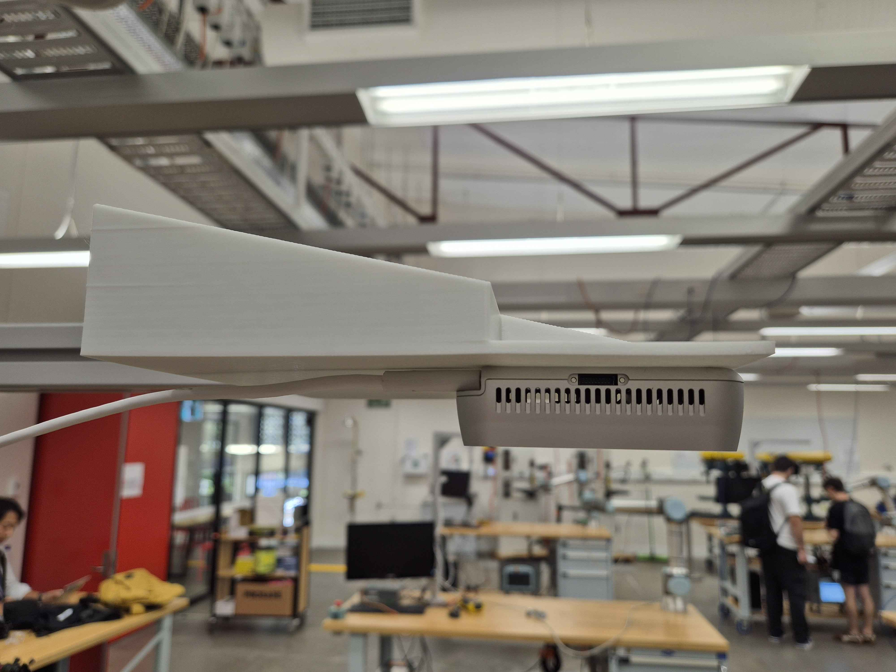
<!--  -->
- Check camera enumeration:
```bash
ls /dev/video*
```
If it shows up the camera then it is good.

### **End-Effector / Gripper**
- Ensure all the links for the gripper are 3d printed
- Fully assemble the gripper shown as:

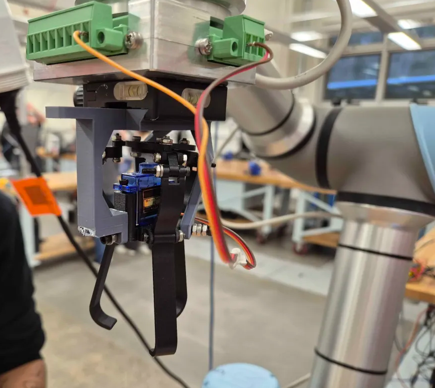
<!--  -->
  
- Mount custom-designed gripper using UR5e flange adapter.
- Upload firmware:
```bash
arduino-cli upload -p /dev/ttyACM0 ArduinoCode.ino
```
- Test motion via serial:
  - `open` → fully open  
  - `close` → close enough to grip standard chess pieces  

### **Electrical**
- Ensure solid grounding between Arduino, UR5e controller, and sensing modules.
- USB isolation is recommended for noise immunity.
- Connect signal to D9 pin

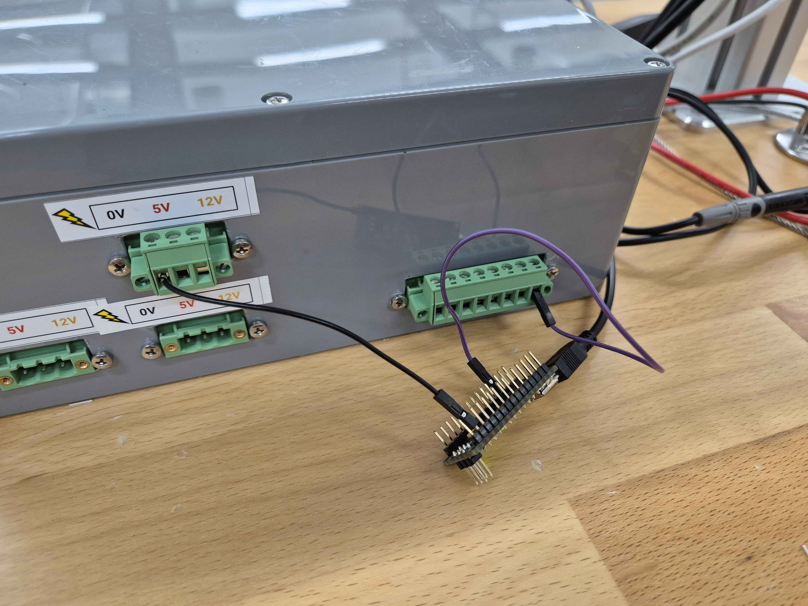
<!--  -->


## 5.4 System Calibration

The following calibrations **must** be performed for accurate gameplay.

### **1. Hand–Eye Calibration (Camera → Robot Base TF)**
Defines transform:
```
camera_frame → chessboard_frame → robot_base_frame
```
Store final values in the TF broadcaster.

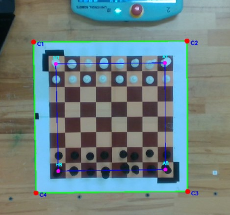

### **2. Z-Height Calibration**
Use robot to probe:
- Height of tall pieces (Kings and queens)  
- Top of board surface

Update values in brain/coordinator.py:
```python
# Define pieces height
KING_HEIGHT = 177.0
PAWN_HEIGHT = 151.85
```

Feel free to change where the robot discard chess pieces:
```python
# DISCARD/HOME coords
DISCARD_COORDS = (353.3, 138.1)
DISCARD_HEIGHT = 240
HOME_HEIGHT = 650
```

These define approach heights and safe drop heights.

<!-- 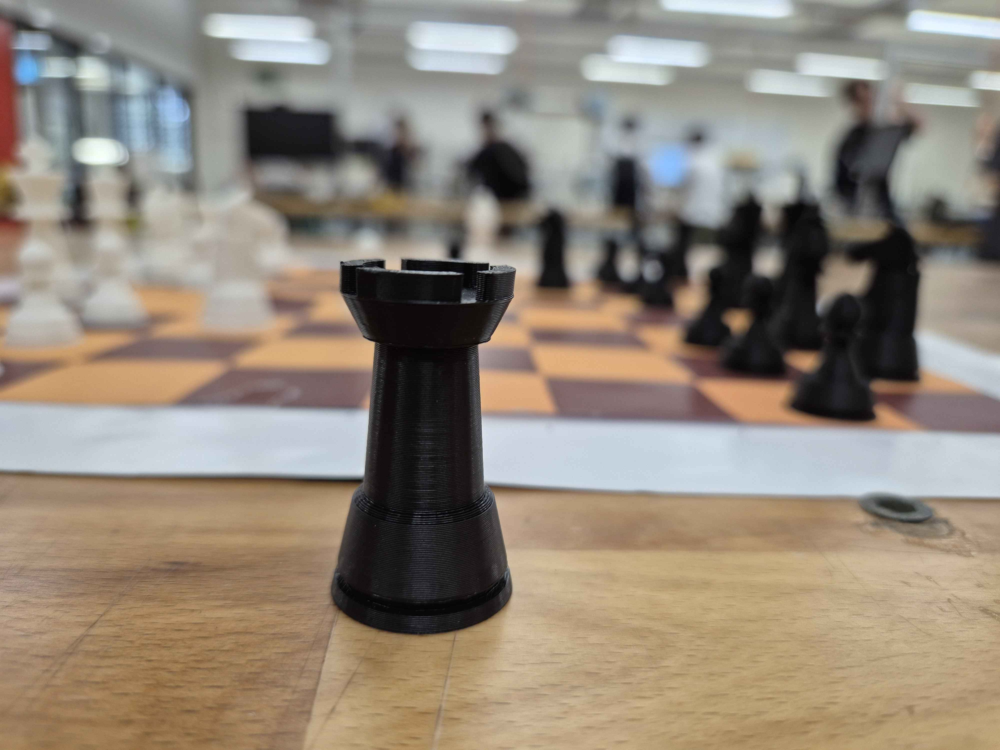 -->
<!--  -->

---

# 6. Running the System

This section describes how to launch, test, and interact with the full chess-robot pipeline.

## 6.1 Full-System Launch

From project root:

```bash
./launch_tmux.sh
```

This launches:
- Realsense camera driver
- UR5e driver  
- MoveIt planner, UR Driver controller and RViz
- Perception stack
- Task coordinator node to coordinate tasks
- Chess master node that runs Stockfish  
- GUI

Open the teach pendent and load in the program
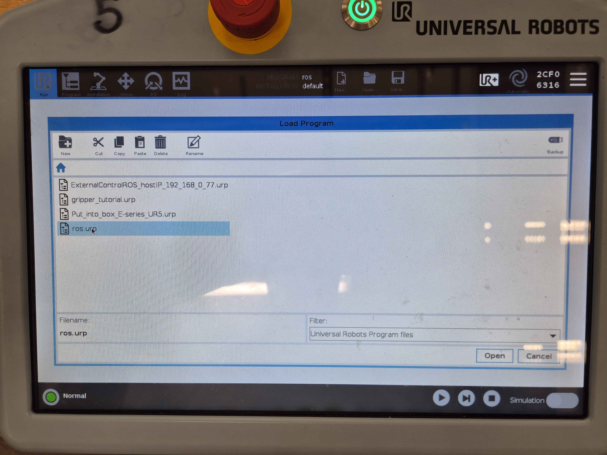
<!--  -->

To kill terminate all nodes:
```bash
tmux kill-session -t chessbot
```
## 6.2 Component-Level Launch (For Debugging)

### **Terminal 1 — MoveIt + UR5e Control**
```bash
ros2 launch <moveit_package> moveit_rviz.launch.py
```

### **Terminal 2 — Vision**
```bash
ros2 run preception chess_detector
```

### **Terminal 3 — Task Coordinator + Chess Master**
```bash
ros2 run brain coordinator
```

### **Terminal 4 — GUI**
```bash
ros2 run ui user_interface
```

## 6.3 What Should Happen During Execution

- RViz displays live UR5e joint states.
- Vision node detects board grid and pieces.
- GUI shows:
  - Board state
  - Status output
   

### **When a move is executed:**
1. The system verifies legality.
2. The planner generates collision-free pick trajectory.
3. The gripper picks piece from source square.
4. The robot moves to destination.
5. Vision system double-checks placement.
6. Game state updates.

## 6.4 Troubleshooting Guide

### **Robot not moving**
- check in Rviz that the robot is simulated, the current position of the robot in real life is accuracte in the simulation
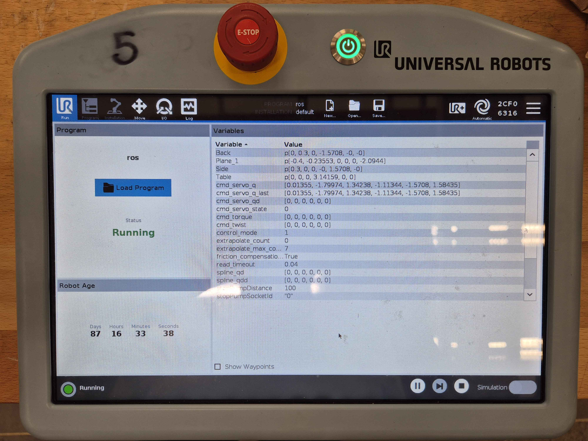
<!--  -->
-    If not the same then check UR5e pandant is in automatic mode.
-    IP mismatch between URCap → ROS driver. Run
```bash
ping 192.168.0.77
```
- If the robot does show up accuractely in RVIZ, check the terminal, if it shows that MoveIt is failing to find a collision-free path, look at which step did it fail at and debug arm_controller_node.cpp.


### **Camera not publishing**
```bash
ros2 topic list | grep image
```
If no result appears:
- Missing drivers --> install realsense camera driver
- 

### **Squares misaligned**
- Open Rviz and add a image topic
- Inside the image topic select image/cropped
- Adjust the board on the table such that it is inside the frame

### **Gripper fails to pick pieces**
- Recalibrate open/close PWM values in `ArduinoCode.ino`. The value are set in by the task coordinator, verfiy 
- Ensure robot approach height is not too low/too high.

---

# 7. Results and Demonstration:

This section presents the system’s performance relative to its design goals, supported by quantitative result, output demosntration, and discussion of the robot’s robustness, adaptability, and innovative aspects.

## 7.1 System Performance

<!-- TODO: add things -->

## 7.2 Quantitative Results

<!-- TODO: add things -->

## 7.3 Operational Demonstration

<!-- TODO: edit if necessary -->
| White border thresholding                    | Board transformation                                 | Occupancy grid generation                    |
| -------------------------------------------- | ---------------------------------------------------- | -------------------------------------------- |
| 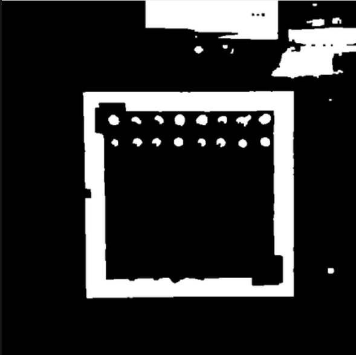 |  | 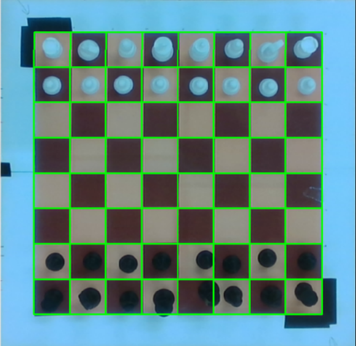 |


- **GUI output**
  
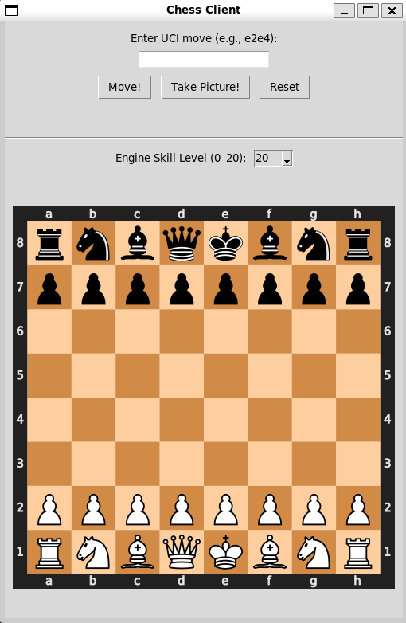

- **Arm Visualization in RViz**

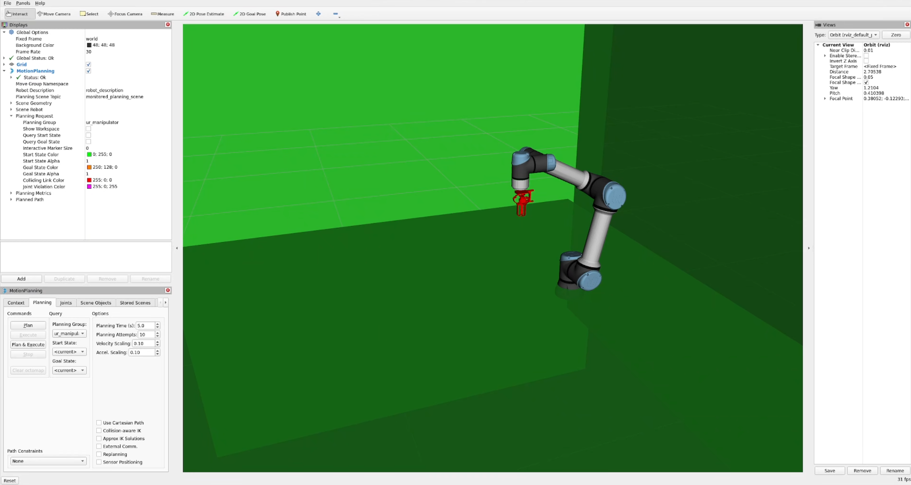

- [**Video Demo**](https://drive.google.com/file/d/1yLkw7y4LNCeMz_NkLVMP5ToxRHmnHbvh/view?usp=sharing)

## 7.4 Robustness, Adaptability, and Innovation

<!-- TODO: add things -->

---

# 8. Discussion and Future Improvements

Throughout development, several engineering challenges emerged across perception, motion planning, end-effector performance, and overall system integration. These areas represent strong opportunities for refinement in a future release of the chess robot platform.

## 8.1 Perception

The current perception pipeline uses HSV thresholding, contour extraction, and difference-based state comparison. While effective under controlled conditions, it was highly sensitive to environmental factors:

- Lighting fluctuations caused inconsistent segmentation.  
- Robot shadows occasionally triggered false detections.  
- A white boundary around the chessboard was required for stable detection.  

### **Future Improvements**

#### **1. Deep-learning-based detection (YOLOv8/YOLOv10)**  
A neural-network detector would be far more resilient to lighting variations and would eliminate the need for artificial borders around the board.

**How to implement:**
1. Collect labelled datasets of piece locations under varied lighting.  
2. Train a YOLO model to detect:
   - 64 square positions  
   - Piece classes (pawn, rook, knight, bishop, queen, king)  
   - Empty squares  
3. Integrate with ROS2 using a custom node or `ros_yolo` packages.  
4. Replace HSV segmentation with bounding-box centroid detection.

#### **2. Depth-sensing integration (Intel RealSense / ZED2i)**  
Depth data helps differentiate between squares, detect piece height, and resolve occlusions.

**How to implement:**
- Fuse RGB + depth into a unified RGB-D perception node.  
- Identify piece height using point cloud clustering.  
- Project depth centroids into the chessboard coordinate frame.

#### **3. Arm-mounted camera for mobile scanning**  
Mounting the camera on the UR5e wrist allows the robot to reposition for more complexed operations.

**Long-term capability:**
- Scan multiple chessboards on different tables using a single camera.  
- Automatically adjust vantage point to reduce occlusions.  

**How to implement:**
1. Add a `camera_link` in the robot URDF + TF tree.  
2. Perform hand–eye calibration.  
3. Create scanning trajectories (raster pattern or targeted waypoints).  
4. Capture images and stitch results into a board state model.


## 8.2 Motion Planning

Although MoveIt handled most tasks well, several limitations were identified:

- Tall pieces increased collision risk during lateral motions.  
- Knight/queen trajectories required more sophisticated approach angles.  
- Small orientation drift could nudge adjacent pieces unintentionally.

### **Future Improvements**

#### **1. Pilz Industrial Motion Planner**  
Pilz provides deterministic LIN/PTP/CIRC motions ideal for tabletop interactions.

**How to implement:**
1. Enable Pilz by updating `planning_pipelines` in MoveIt config.  
2. Use LIN motions for approach, grasp, retreat:  
   - LIN (base → approach)  
   - LIN (approach → grasp)  
   - LIN (grasp → retreat)  
3. Retain PTP only for long-distance moves above the board.

#### **2. Dynamic collision objects from perception**  
Using live perception to update MoveIt’s planning scene reduces accidental bumps.

**How to implement:**
1. Publish each identified piece as a MoveIt collision object.  
2. Update at 5–10 Hz via the PlanningSceneInterface.  
3. Ensure planned paths avoid dynamically placed obstacles.

## 8.3 End-Effector Performance

The current servo-driven finger gripper works reliably but is highly sensitive to alignment and tolerances:

- Minor calibration drift affects grasp consistency.  
- Servo backlash introduces small error in finger positioning, pushing the chess piece out in the release movement.  
- Some pieces are easier to pick than others depending on geometry.
- Current chess piece consists of a small groove that allows for easy picking


<!--  -->

### **Future Improvements**

#### **1. Suction-based gripper**
Ideal for flat-top pieces and independent of rotational alignment.

#### **2. Hybrid magnetic + mechanical design**
Useful for metal-core or retrofitted pieces.

#### **3. Improved servo calibration**
- Add startup homing via limit switches or stall sensing.  
- Smooth PWM transitions to prevent jerky motion.  
- Install a force sensor that measure the pick up exerted by the gripper for secure pick up.
- The gripper flanges doesn't contract and release at the same time due to friction, so the chess pieces will be moved slightly during the placing motion

## 8.4 System Integration

The system relies heavily on accurate TF transforms between:

- `base_link`  
- `tool0`  
- `gripper_link`  
- `camera_frame`  
- `chessboard_frame`  

Small deviations in calibration significantly impacted manipulation accuracy.

### **Issues Observed**
- TF drift caused misaligned picks.  
- Manual calibration is required for each board offseting the white boarder to the corner position A1, A8, H1, H8 consumed time.  
- Camera mounting inconsistencies changed board position estimates.  

### **Future Improvements**
####  Diagnostics and health monitoring
- Add ROS2 Diagnostics messages for vision, gripper, TF, motion state.
- Add in Yolo to automatically adjust the 4 corner poses.
- Display health indicators on the UI.  
- Add a console panel in RViz for real-time alerts.

#### Multi-board and multi-table automation
Paired with an arm-mounted camera, the UR5e could act as a multi-station chess referee.

**How to implement:**
1. Define multiple table frames in the environment.  
2. Implement autonomous navigation between tables (via predefined joint targets).  
3. At each table, trigger a scanning routine.  
4. Create a scheduler to manage multiple concurrent games.

###

Overall, these improvements map a clear pathway toward a more robust, scalable, and fully autonomous chess-playing robotic system that can operate across variable environments and multiple concurrent games.


# 9. Contributors

| Member             | Contribution                                                                    |
| ------------------ | ------------------------------------------------------------------------------- |
| **Ryan Li**        | MoveIt integration, URDF/xacro modeling, TF integration, gripper implementation |
| **Johnnie Parris** | Vision pipeline, depth transforms, TF integration                               |
| **Justin Kwok**    | Game engine integration, task coordination, GUI, gripper implementation         |

Additional support was received in lab sessions from course staff.

---

# 10. Repository Structure

```
.
├── src/                         # ROS 2 packages (moveit config, drivers, vision, chess controller)
├── stockfish/                   # Stockfish chess engine binary & weights
├── ArduinoCode.ino              # Gripper firmware (servo control + motion presets)
├── board.png                    # Calibration board image
├── chess_square.py              # Test file for calculating coordinates of 64 physical board squares
├── environment_setup.sh         # Setup script (deps + build + env)
├── gui_test.py                  # Standalone GUI test file for board visualisation
├── kill_all.sh                  # Terminates all ROS + python nodes
├── launch.sh                    # One-command full system launcher
├── launch_tmux.sh               # Multi-window launcher for debugging
├── master.py                    # High-level game logic + motion sequencing test file
└── robot arm movement steps.txt # Internal motion notes for trajectory design
```

---

The repository follows a modular ROS 2 workspace design. Each major subsystem
(arm control, perception, UI, game logic, custom interfaces, etc.) is isolated
into its own package for clarity, maintainability, and debugging.

Below is a detailed breakdown of each directory, its purpose, and any special notes
about its origin or usage.

```
src/
├── arm_controller/
│   ├── src/arm_controller_node.cpp        # Main robot TCP motion + MoveIt client
│   ├── launch/arm_controller.launch.py    # Launch file for arm control node
│   └── CMakeLists.txt / package.xml
│
├── brain/
│   └── brain/coordinator.py               # High-level control node handling pipeline
│
├── chess_master/
│   ├── chess_master/chess_master.py       # Service node handling verified chess moves
│   ├── chess_master/__init__.py
│   └── CMakeLists.txt / package.xml
│
├── custom_interfaces/
│   ├── action/
│   │   ├── GripperCommand.action          # Custom action for opening/closing gripper
│   │   └── MoveTCP.action                 # Cartesian motion action for UR5e TCP
│   └── srv/
│       └── ChessMove.srv                  # Service for making a validated chess move
│
├── end_effector_description/
│   ├── urdf/                              # URDF/XACRO files for the custom gripper
│   ├── meshes/                            # STL/DAE meshes of the gripper
│   ├── config/                            # RViz + joint configuration
│   ├── rviz/
│   └── launch/
│       ├── display.launch.py              # Visualize end-effector only (testing)
│       └── display_ee.launch.py           # Joint state publisher + gripper visualization
│
├── gripper/
│   ├── gripper/gripper_bridge_node.py     # ROS <-> Arduino serial bridge
│   ├── gripper/gripper_server.py          # Action server for gripper open/close
│   ├── gripper/gripper_client.py          # Client used by arm_controller
│   └── launch/gripper_bringup.launch.py   # Brings up gripper control stack
│
├── perception/
│   ├── perception/aruco_detect.py         # ArUco board detection (optional)
│   ├── perception/chess_detector.py       # Main HSV + contour-based chessboard detector
│   ├── perception/image_publisher.py      # USB camera publisher
│   ├── perception/state_comparison.py     # Detects piece movement between frames
│   ├── resource/
│   ├── test-images/                       # Ground truth test images
│   └── test/                              # Automated testing utilities
│
├── ui/
│   └── ui/user_interface.py               # Tkinter interface for game monitoring
│
├── ur5e_custom_description/               # NOT USED — kept for archival only
│   # (Old experiment — deprecated. Replaced completely by end_effector_description.)
│
├── ur5e_moveit_config_custom/
│   # This is the **actual MoveIt config used** by the robot.
│   #   Generated using MoveIt Setup Assistant and fully customised
│   #   to integrate the custom end-effector.
│   ├── config/
│   │   ├── end_effector_withDriverSupport.srdf  # SRDF defining planning groups
│   │   ├── initial_positions.yaml               # Used for RViz display startup
│   │   ├── joint_limits.yaml                    # URDF+MoveIt joint limits
│   │   ├── kinematics.yaml                      # IKFast/KDL solver config
│   │   ├── moveit_controllers.yaml              # MoveIt2 control mappings
│   │   ├── pilz_cartesian_limits.yaml           # Constraints for Pilz planner
│   │   └── moveit.rviz
│   ├── launch/
│   └── CMakeLists.txt / package.xml
│
├── ur_moveit_config_official/
│   #  Downloaded from **Universal Robots official MoveIt2 repository**.
│   #   Used as a clean, correct reference model for:
│   #     • MoveIt Setup Assistant input  
│   #     • URDF baseline (without our gripper)  
│   #     • Re-exporting custom configs
│   #   NOT used at runtime.
│   └── (Official UR-provided files)
│
└── ur5e_custom_description/                # Duplicate note: remains unused
```


##  Important Notes About UR Packages

### **`ur_moveit_config_official/`**
- Pulled directly from the official Universal Robots MoveIt2 repository.
- Used **only for MoveIt Setup Assistant workflows**:
  - exporting correct SRDF groups  
  - inheriting correct joint limits  
  - ensuring compatibility with UR5e URDF  
- **Never launched during runtime** — serves as a clean reference.

### **`ur5e_moveit_config_custom/`**
- **The MoveIt package actually used in the project.**
- Integrates:
  - Custom end-effector  
  - Custom joint limits & planning groups  
  - Corrected SRDF  
  - Collision meshes for the gripper  
- Generated using MoveIt Setup Assistant, starting from the official UR package above.

### **`ur5e_custom_description/`**
- An early prototype.
- No longer used in MoveIt or any launch files.
- Kept only for documentation and archival reasons.


## Summary of Package Responsibilities

| Package                     | Purpose                                                                 |
| --------------------------- | ----------------------------------------------------------------------- |
| `arm_controller`            | Executes TCP motions, MoveIt control, action clients                    |
| `brain`                     | High-level control logic (task coordinator)                             |
| `chess_master`              | Validated chess move service + game coordination                        |
| `custom_interfaces`         | Action & service definitions (`MoveTCP`, `GripperCommand`, `ChessMove`) |
| `end_effector_description`  | URDF, meshes, and visualization for custom gripper                      |
| `gripper`                   | ROS ↔ Arduino interface, gripper action server                          |
| `perception`                | HSV board detection, ArUco detection, move comparison                   |
| `ui`                        | Tkinter front-end for monitoring board & robot state                    |
| `ur_moveit_config_official` | Official UR reference package — used only for Setup Assistant           |
| `ur5e_moveit_config_custom` | Actual MoveIt config used during operation                              |
| `ur5e_custom_description`   | Old unused package retained for reference                               |


# 11. References & Acknowledgements

### **Frameworks and Libraries**
- ROS 2 Humble  
- MoveIt 2 Planning Framework  
- UR5e ROS 2 Driver  
- OpenCV for vision  
- Stockfish chess engine  
- python-chess Python library

### **Academic Resources**
- MTRN4231 Robotics Course Notes  
- UR5e technical documentation  
- ROS 2 TF2 tutorials on camera calibration  

### **Special Thanks**
- MTRN4231 teaching team for ongoing support  
- Lab demonstrators David Nie and Alex Cronin for guidance and assistance  
- Fellow student teams for collaboration and shared testing time Nail Bot and Jenga Bot

---

    


